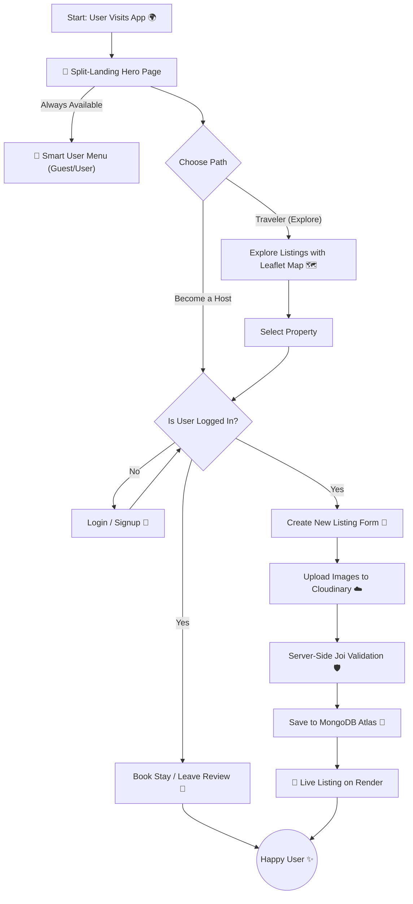

<div align="center">

</div>

WanderLust is a hotel booking web application that allows users to easily browse through various listings and reserve accommodations. It provides a clean interface for travelers to discover unique places to stay and allows hosts to list their properties for rent.

This is my first major fullstack project where I handled both the frontend and backend development. It is built as a functional clone of Airbnb and is designed with a responsive layout to ensure a seamless experience on both mobile phones and desktop computers.

> *⭐ If this project helped or inspired you, consider giving it a star — it really motivates me to keep building!*

<br>

## 🚀 Live Demo

Click here to explore unique stays and start your journey! 👉 [ **[ 🌏 WanderLust 🗺️ ]** ]( https://wanderlust-du5m.onrender.com )

> 💡 **Pro Tip:** Login is hassle-free! You don't need a real email ID—just create a dummy account to test features like adding reviews. 😜
>
> 😎 **Try this:** Visit the app both as a **Guest** and while **Logged In**. The interface is smart enough to detect your status and completely adapts the User Menu and features accordingly!

<br>

## 🤖 AI-Powered Workflow

I follow an AI-assisted development approach to improve productivity and code quality.  
In this project, AI was used as a collaborative pair programmer for debugging, structuring backend logic, and refining implementation details, rather than simply generating code.

| 🛠️ Tool | 💡 How I Used It |
| :--- | :--- |
|  | **Concept Generation:** Used for understanding backend concepts, debugging errors, designing Express routes, and improving project structure. |

### 🚀 Key Lessons from AI Collaboration
* **🚫 "Trust but Verify":** I learned **when to deny** AI code. AI often suggests deprecated packages or "hallucinated" variables. I manually verified every suggestion against documentation.
* **🗣️ Prompt Engineering (Bad Input === Bad Output):** I realized AI is only as smart as my instructions. Learning to write specific, context-aware prompts saved hours of debugging.
* **🧱 Bridging the Knowledge Gap:** AI helped me implement professional features I had never touched before (like **Cron Jobs** and **Leaflet Maps**) by explaining the *logic*, not just giving the code.

<br>

## 🛠️ Tech Stack

| Category | Technologies |
| :--- | :--- |
| **🎨 Frontend** |      |
| **⚙️ Backend** |     |
| **💽 Database** |    |
| **🗺️ Maps & Tools** |     |

<br>

## 🚀 Key Features
**Beyond the beautiful UI, WanderLust is built on a robust full-stack architecture.** Here is a breakdown of the complex engineering challenges powering the application.

| Category | Feature | Technical Implementation |
| :--- | :--- | :--- |
| 🧠 **Core Logic** | **Full MVC Architecture** | Built with a scalable **Model-View-Controller** pattern to keep code clean and modular. |
| 🔐 **Security** | **Authentication & AuthZ** | Secure login using **Passport.js** (Salt/Hash) 🛡️ + Middleware for strict route protection. |
| 🧪 **Data** | **Automated DB Seeding** | One-command database regeneration with realistic demo data and ownership-safe review logic. |
| 🗺️ **UX/UI** | **Interactive Maps** | Integrated **Leaflet** APIs for dynamic location pinning and geocoding 📍. |
| 📱 **Mobile** | **Touch-Optimized UI** | Custom **"Double-Tap" logic** 👆 to handle complex animations smoothly on touch devices. |
| ☁️ **Data** | **Cloud Image Storage** | Optimized image uploading and storage handling using **Cloudinary** 📸. |
| 🚧 **Safety** | **Server-Side Validation** | robust data validation with **Joi** to prevent injection attacks and ensure data integrity. |
| 💬 **Feedback** | **Flash Messages** | Real-time success/error notifications using **Express-Flash** for better user guidance ✨. |

<br>

## 📂 Project Structure
**WanderLust follows a strict MVC (Model-View-Controller) architecture to ensure scalability and code maintainability.**
```bash
airbnbproject/
│
├── models/
├── routes/
├── controllers/
├── views/
├── public/
├── utils/
├── init/
├── app.js
└── package.json

<br>



<br>

## 🧠 Learning Outcomes

**Building WanderLust transformed my theoretical knowledge into production-grade engineering skills.**

| 🎓 Domain | 🚀 Key Takeaways & Skills Mastered |
| :--- | :--- |
| **🏗️ Architecture** | Mastered the **MVC (Model-View-Controller)** pattern, decoupling logic to ensure the codebase is scalable and maintainable. |
| **💽 Database Engineering** | Designed complex **One-to-Many relationships** in MongoDB (connecting Users ↔ Listings ↔ Reviews) and handled cascading deletes. |
| **🤖 AI-Pair Programming** | Leveraged **Generative AI** for architectural planning, debugging complex logic errors, and optimizing documentation workflows (Prompt Engineering). |
| **🔒 Security** | Implemented robust security measures including **Session-based Authentication** (Passport.js), **Joi Validation**, and Environment Variable protection. |
| **⚡ Performance Ops** | Solved the "Cold Start" problem on Render by implementing **Cron Jobs** to keep the server active and responsive. |
| **🌐 API Integration** | Replaced paid mapping services with **Open-Source alternatives** (Leaflet + Nominatim), mastering asynchronous data handling. |

<br>

## 🪄 Installation & Setup

**Want to run this project locally? Follow these simple steps.**

**1. Clone the repository**
```bash
git clone  https://github.com/nitinkumar593/Wanderlust-Project
cd WanderLust
```

**2. Install Dependencies**
```bash
npm install
```

**3. Configure Environment Variables**<br>
Create a `.env` file in the root directory and add the following keys:
```bash
CLOUD_NAME=your_cloudinary_name
CLOUD_API_KEY=your_cloudinary_api_key
CLOUD_API_SECRET=your_cloudinary_api_secret
ATLASDB_URL=your_mongodb_connection_string
MY_SECRET=your_session_secret
```

**4. Start the Application**
```bash
node app.js
```

**5. Visit the app**
```bash
http://localhost:8080
```

**6. Database Regeneration**<br>
This project uses one shared password for all seeded demo users (defined via environment variables).
Add this to your .env file:
```bash
SEED_USER_PASSWORD=your_strong_dev_password
```

Then regenerate the database with demo users, listings, images, and reviews:

```bash
node init/init.js
```

> **⚠️ This command clears existing data and is intended for local development only.**

<br>

## 🚀 Deployment
**WanderLust is production-ready and deployed using modern cloud infrastructure.**

| Service | Role |
| :--- | :--- |
| **Render** | Full-stack hosting with **CI/CD** integration for automated deployments. |
| **MongoDB Atlas** | Managed Cloud Database ensuring high availability and data persistence 💽. |
| **Cloudinary** | Content Delivery Network (CDN) for optimized image storage and serving ⚡. |
| **Cron-job.org** | Automated "Keep-Alive" pings to prevent server sleep and eliminate cold-start latency ⚡. |
> ⚡ **Performance Note:** I configured an external **Cron Job** to ping the server every 14 minutes. This prevents the Render free-tier from "sleeping," ensuring instant load times for all users.

<br>
---

<h3 align="center">
  Made with 💖 by <a href="https://www.linkedin.com/in/nitin-kumar-eng/" target="_blank">Nitin kumar</a>
</h3>

---
